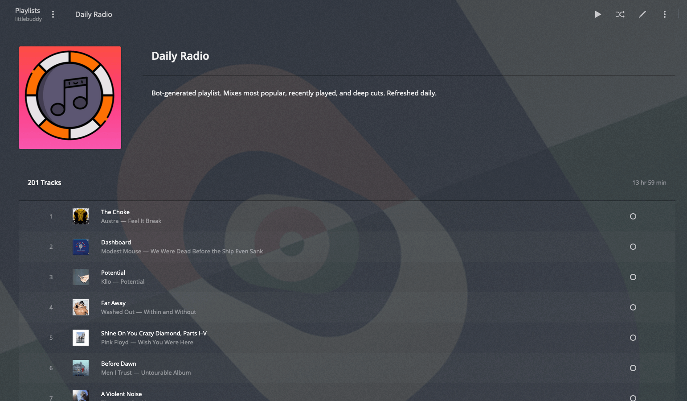

# Plex Music Bot

Python scripts for automatically building radio-like music playlists in Plex.




## Getting Started

Install requirements with pip: `pip install -r requirements.txt`


## Example Usage

```
python generate.py -u "plex_username" -p "plex_password" -r "plex_server" -t "My Cool Playlist" -c 120
```

## How Does It Work

Random playlists are best when they are not random. Out of the box, this script builds a "random" playlist through two steps.

First, it creates three groups of songs from your music library:

1. Popular Tracks - The top 15% of your music library as ranked by total play count
2. Recent Tracks - The 15% of your music library you've most recently added
3. Spice Tracks - A truly random selection of other songs from your music library

The script picks songs in an order that's similar to how radio stations balance new, popular, and recurrent music throughout the day. By default, this is the order used:

1. Popular
2. Recent
3. Popular
4. Spice
5. Popular
6. Recent

Second, the script applies a weight to each song in each category. This weight is used when "randomly" selecting a song from each list. If each list is a dart board, the weight determines how big or small the area each song represents on the board. The weight is generated using a number of factors, each normalized against the rest of the music library, including:

* Play count
* Recency of plays
* User rating
* Artist play count
* Album play count
* Genre play count

So a spice track that's part of a genre you've played a lot will have a higher chance of being selected than others, for example.

With all of this, the script can build a "random" playlist that feels curated to your preferences and will evolve to match your listening habits.